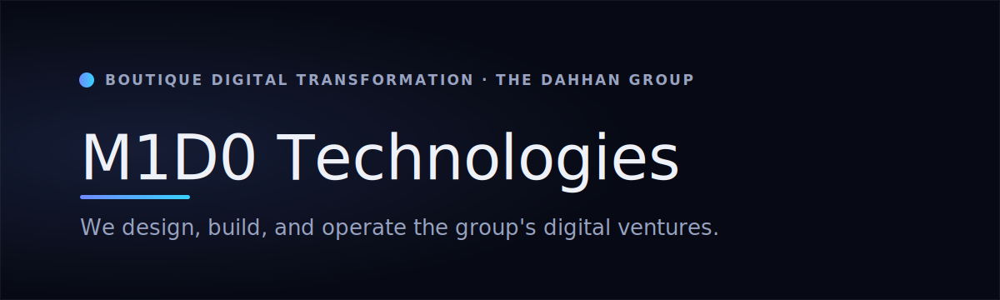

  

  
  
  
  

## M1D0 Technologies

**M1D0 Technologies is a boutique digital-transformation practice — the team that builds and operates the software, automation, and infrastructure behind the Dahhan Enterprises group's ventures.** We carry the same engineering thinking from the first decision through to running the system in production.

This organization is a **public portfolio, not a code dump.** It shows the work — the products, the approach, and the engineering posture — while product source stays private. Each repository below is a documentation-only showcase: a short overview, live links, and an honest status.

> **Dahhan Enterprises** is the business and ownership group. **M1D0 Technologies** is the practice that builds and operates for it — and for a small number of outside organizations under long-term partnerships.

---

## Portfolio

| Venture | What it is | Status |
|---|---|---|
| **[M1D0 Technologies](https://github.com/M1D0-Technologies/m1d0-technologies)** | Digital transformation — strategy through to production | [m1d0.com](https://www.m1d0.com) · 🟡 Launching soon |
| **[Dahhan Enterprises](https://github.com/M1D0-Technologies/dahhan-enterprises)** | The group's business front door | [dahhanenterprises.com](https://www.dahhanenterprises.com) · 🟡 Launching soon |
| **[Dahhan Industries](https://github.com/M1D0-Technologies/dahhan-industries)** | Industrial textile manufacturing · OEM · wholesale | [dahhanindustries.com](https://www.dahhanindustries.com) · 🟡 Launching soon |
| **[Miss Dantella](https://github.com/M1D0-Technologies/miss-dantella)** | A 35+ year house of lace, lingerie and elastic | [missdantella.com](https://www.missdantella.com) · 🟡 Launching soon |
| **[FoodAtlas](https://github.com/M1D0-Technologies/foodatlas)** | Food-intelligence platform — ingredient facts, with their sources | 🔧 In development |

> Live surfaces are intentionally **maintenance-gated** — each presents a *"Launching soon"* page until it is deliberately released with owner approval. Show the work, not the code.

---

## How we build

We run our own platform the same way we build for clients — so the posture below is lived, not theoretical.

### How we built ourselves

The group runs on a **self-hosted platform we designed and operate end to end**: our own servers, a full observability stack (metrics, logs, traces, and uptime), GitOps deployment, self-hosted content and business systems, and in-house operations tooling — all behind zero-trust access, defined as code, and recoverable by design.

→ The engineering story in depth: **[`platform-engineering`](https://github.com/M1D0-Technologies/platform-engineering)**

### How we build for businesses

For each client we work to *their* requirements, at the same standard: **fail-closed, infrastructure-as-code, observable, and review-gated.** Strategy, software, automation, and managed infrastructure — delivered as one accountable lifecycle rather than a hand-off, and built for efficiency, resilience, and long-term operability.

---

## The stack we standardize on

  
  
  
  

A single, modern application standard — Next.js · React · TypeScript · Tailwind — self-hosted behind a hardened edge, so an improvement made once carries across the group.

---

## Work with us

M1D0 Technologies takes on modernization, custom software, automation, and managed-infrastructure engagements.

- 🌐 **[m1d0.com](https://www.m1d0.com)**
- ✉️ **contact@m1d0.com**

© 2026 Dahhan Enterprises LLC — M1D0 Technologies, Dahhan Industries, Miss Dantella and affiliated brands. All rights reserved. This organization publishes documentation and showcase material only; product source code is private.
